# Smilcool 

> 微校 - 高校资源综合发布系统

⛔️ 你好，很高心你关注了这个项目，但非常抱歉，实际上这是一个应付毕设的半成品，不过项目中关于 Shiro 和 Netty 的部分花了我很多功夫，我觉得可以看一下啦。谢谢😁

[演示视频（点击播放）](./assets/演示视频.mp4)

<a href="./assets/演示视频.mp4">
  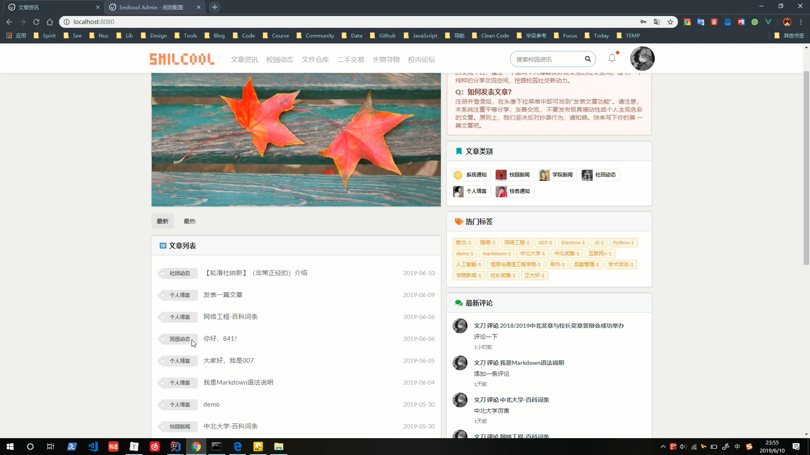
</a>

  
## 如何运行

抱歉，这部分比较复杂，我正在优化项目中。当前需要你安装 MySQL、ElasticSearch、Redis（可选）才能运行，整体步骤比较繁琐，不利于查看项目。（后续优化中。。。）

建表语句：[init-table.sql](./smilcool-server/src/main/resources/db/init-table.sql)

## 功能设计

管理模块：权限管理、系统管理、资源管理

业务模块：账户业务、全文搜索、即时通讯、资源业务

## 架构设计

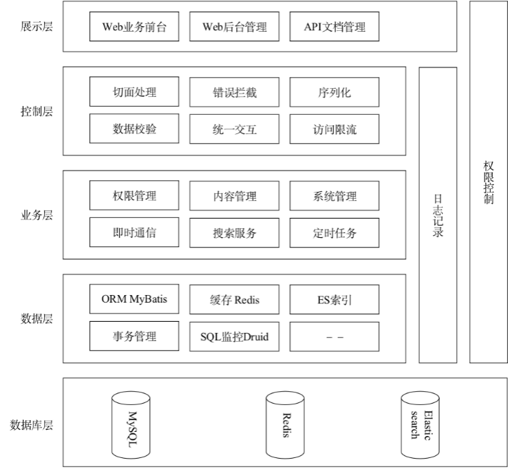

## 技术选型

前端：Vue、Vuex、Axios、iView、Semantic UI Vue 等

后台：SpringBoot、MyBaits、Swagger、Shiro、Redis、ElasticSearch、Netty、MySQL 等

## 后台管理截图

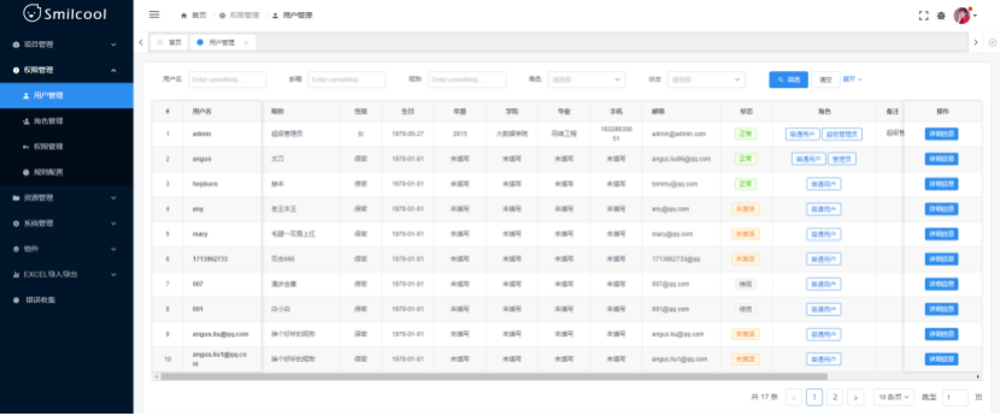

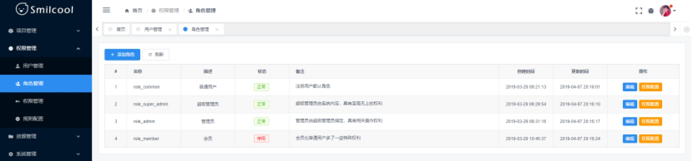

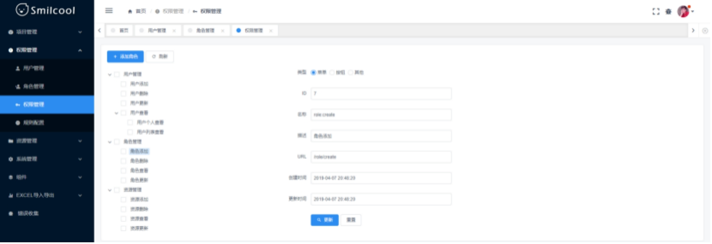

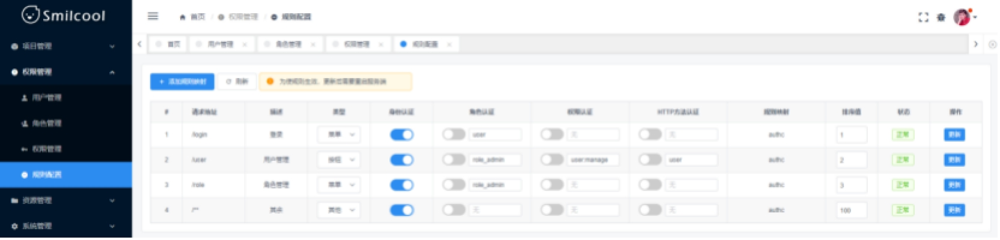

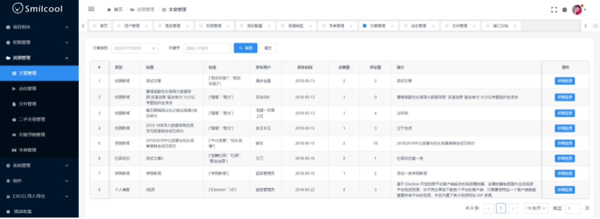

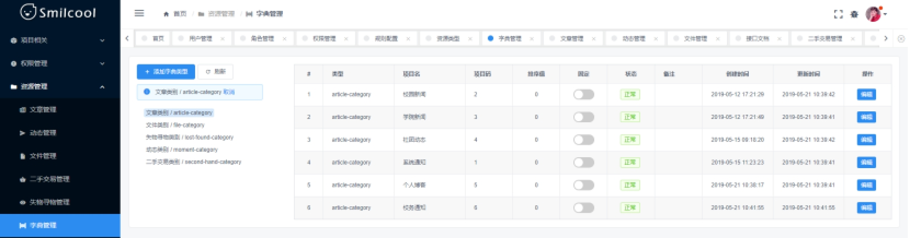

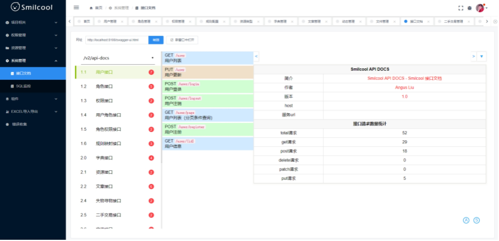

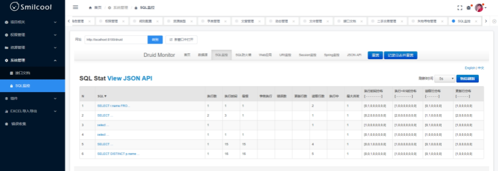

## 前端业务截图

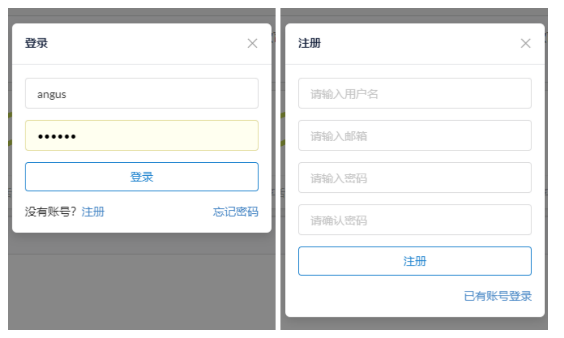

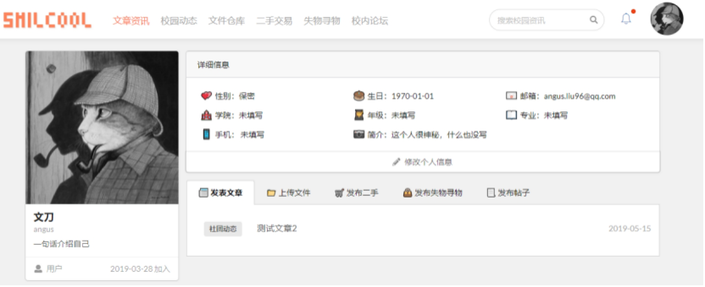

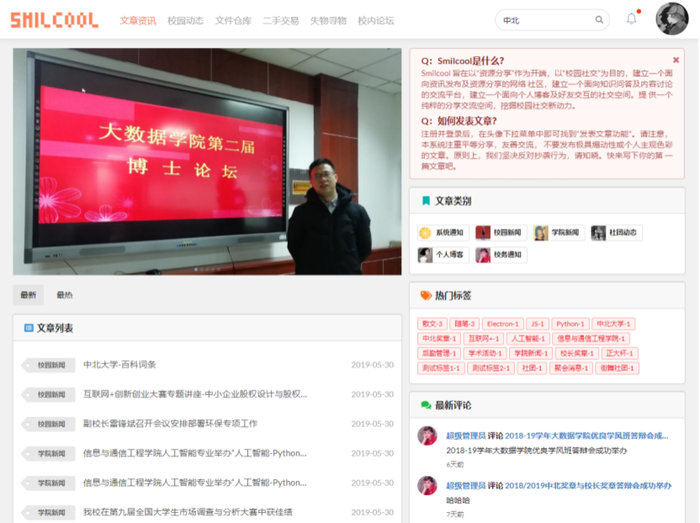

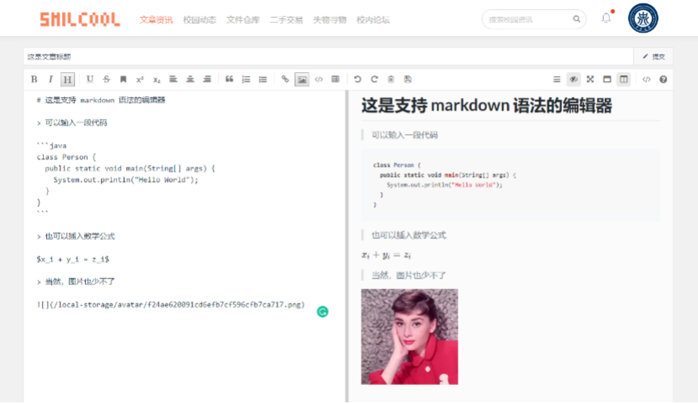

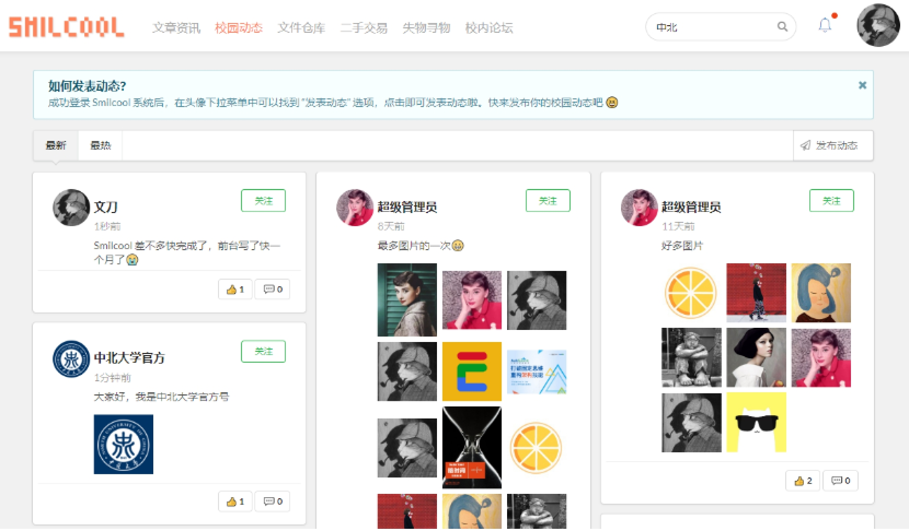

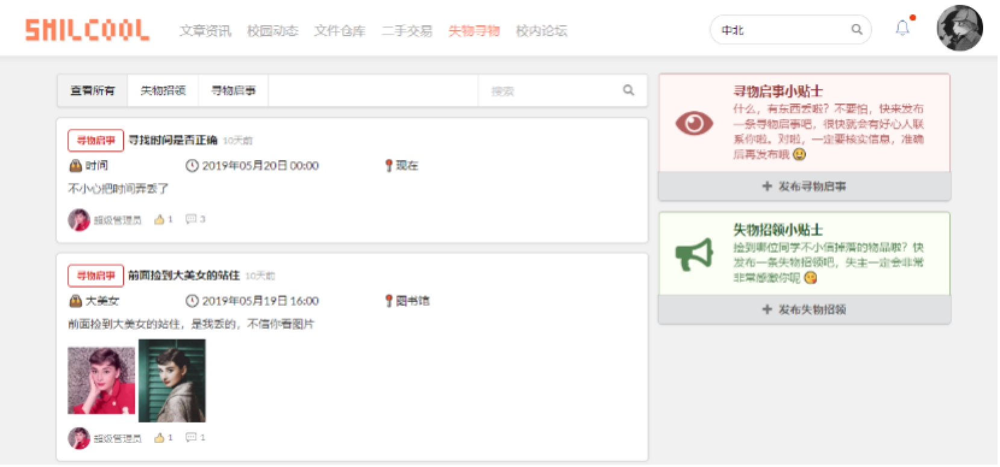

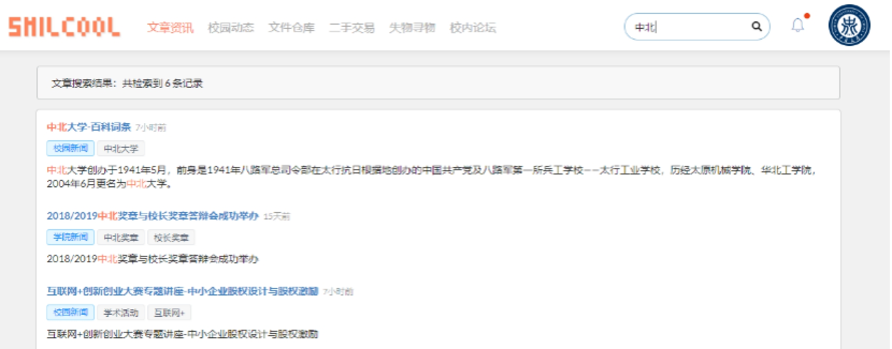

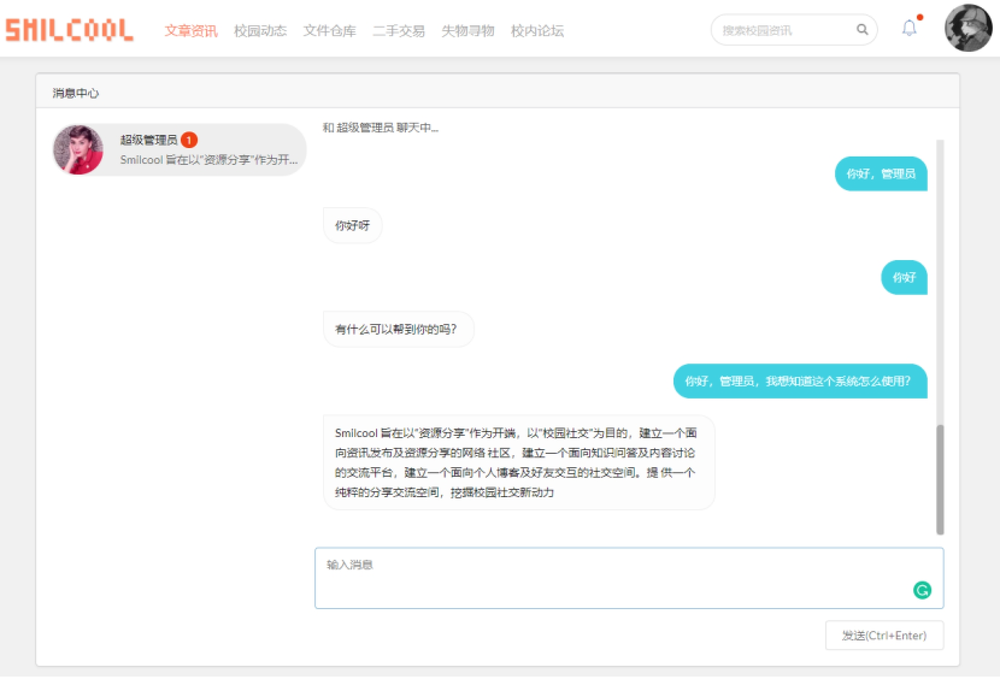
